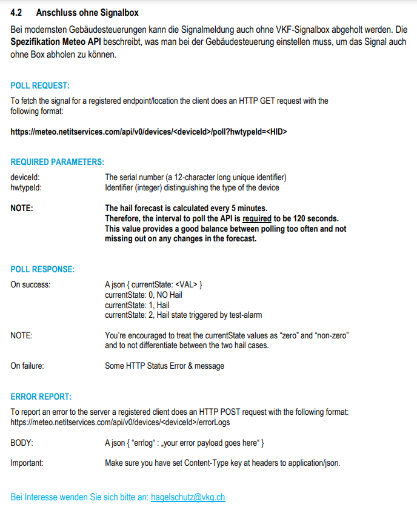

# VKF_Hagelschutz_API

## Arduino Projekt

Das Projekt nutzt die Schweizer Vereinigung Kantonaler Gebäudeversicherungen (VKG) API

### Hagelschutz

<https://www.vkg.ch/de/naturgefahren/>

## Hagelschutz Dokumentation

<https://www.vkg.ch/de/naturgefahren/praevention/dokumente-hagelschutz/>

